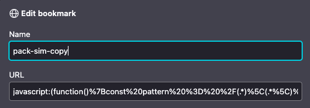

# Bookmarklet to export pulls from pokemoncard.io/pack-sim

https://pokemoncard.io/pack-sim/ is a handy service to open virtual Pokemon TCG packs.

It doesn't have a good way to export the pulls though so I wrote this bookmarklet.

You can inspect the full script in export-pack-sim.js and you can install it as bookmarklet by creating a new bookmark and copying the code from `export-pack-sim-bookmarklet` into the URL field.



Running the bookmarklet will copy the pulls list into your clipboard with the following format.

```plain
1 Skiddo  sv1-11
1 Pawmi  sv1-74
1 Wattrel  sv1-77
1 Wiglett  sv1-56
2 Lechonk  sv1-155
3 Capsakid  sv1-28
2 Bisharp  sv1-133
1 Pineco  sv1-1
1 Floette  sv1-92
2 Flittle  sv1-100
1 Pawmo  sv1-75
1 Lechonk  sv1-154
1 Drifloon  sv1-89
```

You can then paste it into wherever you keep your notes.

## Acknowledgements

This project has been a recipient of Reaktor's [Juice Open Source Program](https://www.reaktor.com/articles/giving-back-to-open-source).
